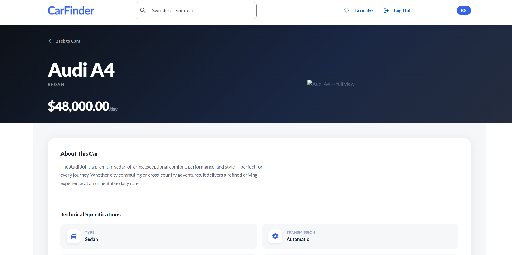
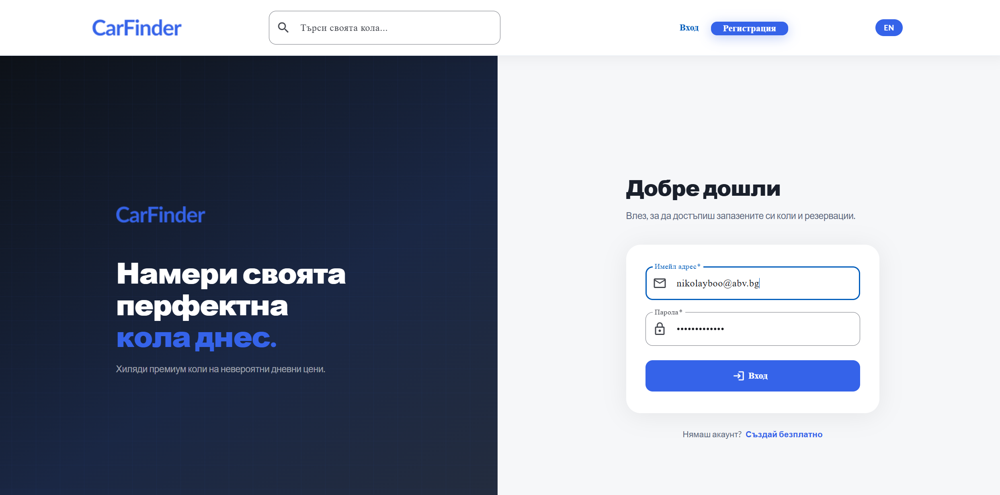

# Car Finder

A full-stack car rental discovery platform built with modern Angular and a serverless backend. Users can browse, search, and save their favourite vehicles, with a fully responsive UI and real-time data from Supabase.

[](https://github.com/nikolaybo/CarFinder/actions/workflows/ci.yml)
[](https://github.com/nikolaybo/CarFinder/actions/workflows/e2e.yml)
[](https://github.com/nikolaybo/CarFinder/actions/workflows/codeql.yml)


**Live demo (Staging):** https://carfinder-z4ir.onrender.com/
**Live demo (Production):** https://carfinder-production.onrender.com

## Screenshots

| Homepage | Car detail | Login |
| --- | --- | --- |
|  |  |  |

---

## Running with Docker

### Prerequisites
- [Docker Desktop](https://www.docker.com/products/docker-desktop/) (or Docker Engine + Compose)
- A [Supabase](https://supabase.com) project with the URL and anon key ready

### Steps

```bash
# 1. Clone the repo
git clone https://github.com/nikolaybo/CarFinder.git
cd CarFinder

# 2. Create your environment file
cp .env.example .env
```

Open `.env` and fill in your Supabase credentials:

```env
SUPABASE_URL=https://your-project-id.supabase.co
SUPABASE_KEY=your-anon-public-key
PORT=4000
```

```bash
# 3. Build the image and start the container
docker compose up --build

# 4. Open the app
open http://localhost:4000
```

To stop:

```bash
docker compose down
```

> The container runs the Angular SSR server on port `4000`. All routes are client-rendered — Supabase credentials are injected at request time via `window.__env` so they are never baked into the static bundle.

---

## Tech Stack

### Frontend Framework — Angular 19

Built on Angular's latest release using exclusively **standalone components** — no `NgModule` boilerplate. Every component leverages:

- **Signals** (`signal`, `computed`, `effect`) for fine-grained, synchronous reactive state
- **`ChangeDetectionStrategy.OnPush`** across every component for maximum rendering performance
- **`inject()`** function-style dependency injection over constructor injection
- **`takeUntilDestroyed()`** + `DestroyRef` for automatic subscription cleanup
- **Lazy-loaded routes** via `loadComponent` — each page is a separate async chunk, reducing initial bundle size
- **Server-Side Rendering (SSR)** via `@angular/ssr` + Express — pages are pre-rendered on the server for fast first-paint and SEO.

### UI — Angular Material 19 + Tailwind CSS

A dual-layer styling system:

- **Angular Material 19 (MDC-based)** provides accessible, production-grade UI primitives: form fields, buttons, icons, spinners, and more — all with keyboard and screen-reader support out of the box
- **Tailwind CSS 3** handles layout utilities and responsive breakpoints (`container`, `mx-auto`, responsive grid variants)
- **Custom design tokens** via CSS custom properties (`--primary`, `--radius-card`, `--shadow-hover`, etc.) keep the visual language consistent across all components
- **BEM methodology** throughout all component templates and SCSS files — every element is self-documenting even without styling needs
- **Global SCSS** (`styles.scss`) houses shared keyframe animations (`fadeUp`, `float`, `shimmer`, `slotDrop`), scroll-driven reveal utilities, and Angular Material MDC overrides

### Backend & Database — Supabase

[Supabase](https://supabase.com) provides the entire backend as a managed service:

- **Authentication** — email/password sign-up and sign-in via Supabase Auth, with session state propagated through a `ReplaySubject`-backed `AuthService`. Auth state changes trigger immediate reactive updates across the app
- **PostgreSQL database** — cars and favourites are stored in a real Postgres instance. All queries go through the Supabase JS client and are wrapped in `Observable` streams via `from()` for seamless RxJS integration

### State Management

No third-party state library. State is managed at the appropriate layer:

- **`FavoritesService`** — a singleton reactive store for favourite car IDs. Holds a `signal<Set<string>>`, loads once on auth state change, and exposes an `isFavorite(id)` computed check. Components read from it via `computed()` — no DB calls per card
- **`CarService`** — holds a `signal<Car | null>` for the selected car, acting as a client-side cache between the list and detail views to avoid redundant network requests
- **`AuthService`** — `ReplaySubject<UserResponse | null>(1)` backed by `onAuthStateChange`, exposing both the raw response and a clean `currentUser$: Observable<User | null>` for components

### Runtime Internationalization (i18n)

A lightweight, zero-dependency runtime translation system built in-house:

- **`TranslationService`** — signal-based service that loads flat-key JSON files from `assets/i18n/{locale}.json` via `HttpClient`. Locale preference is persisted to `localStorage`
- **`TranslatePipe`** — `pure: false` pipe backed by an `effect()` that calls `ChangeDetectorRef.markForCheck()` on locale change, ensuring every `OnPush` component re-renders instantly
- **`SlotTextDirective`** — accepts translated text as a signal input (`[appSlotText]="key | translate"`), uses `effect()` to re-render animated letter spans on every locale change. Browser-only DOM manipulation guarded by `isPlatformBrowser`
- Supports **English** and **Bulgarian** — switching is instant with no page reload or server round-trip

### Build Tooling

- **esbuild** via `@angular-devkit/build-angular:application` — Angular's modern builder. Significantly faster cold builds and rebuilds than the legacy Webpack-based builder
- **Development config** — `optimization: false`, `namedChunks: true`, `extractLicenses: false` for readable output during development
- **Production config** — full minification, tree-shaking, and bundle budgets

---

## Project Structure

```
src/
├── app/
│   ├── common/
│   │   ├── directives/        # SlotTextDirective
│   │   ├── pipes/             # TranslatePipe, FormErrorPipe
│   │   └── global-constants.ts
│   ├── components/
│   │   ├── car-list/          # CarListComponent, CarItemComponent, CarViewComponent
│   │   ├── global/            # Header, Footer, Search, Menu, PageNotFound
│   │   ├── homepage/          # Hero section + car listing page
│   │   └── user/              # Login, Register, Profile
│   ├── guard/                 # authGuard, guestGuard (functional CanActivateFn)
│   ├── interfaces/            # Car, typed Supabase responses
│   └── services/
│       ├── auth/              # AuthService
│       ├── car/               # CarService (selected-car signal cache)
│       ├── database/          # DatabaseService (all Supabase queries → Observable)
│       ├── favorites/         # FavoritesService (reactive favorites store)
│       ├── supabase/          # SupabaseService (single client instance)
│       └── translation/       # TranslationService
├── assets/
│   ├── fonts/Lato/            # Self-hosted Lato (Thin → Black, all weights)
│   ├── i18n/                  # en.json, bg.json
│   └── images/
└── server.ts                  # Express SSR server
```

---

## Getting Started

```bash
# Install dependencies
npm install

# Start development server (with SSR)
ng serve

# Production build
ng build
```

Open `http://localhost:4200` in your browser. The app reloads automatically on file changes.

---

## Testing

The project ships with three layers of tests:

| Layer | Tooling | Command |
| --- | --- | --- |
| Unit | Karma + Jasmine | `npm test` (watch) / `npm run test:ci` (single run + coverage) |
| Structural | Jasmine (no TestBed) | included in `npm test` — see `src/app/app.routes.spec.ts` |
| End-to-end | [Playwright](https://playwright.dev) | `npm run e2e:install` once, then `npm run e2e` |

E2E suites live under `e2e/` and follow the **Page Object** pattern — selectors are centralised in `e2e/pages/*` so a template change touches one file. Shared fixtures (e.g. `unauthenticatedPage`, which clears any persisted Supabase session) live in `e2e/fixtures.ts`.

```bash
# Run unit tests in CI mode (headless Chrome, single run, coverage to /coverage)
npm run test:ci

# Run Playwright tests against a freshly-spawned dev server
npm run e2e

# Interactive Playwright UI — great for debugging selectors
npm run e2e:ui
```

Coverage targets ≥ 80% on services, guards, and pipes.

---

## Continuous Integration

Three GitHub Actions workflows guard `main` and every PR:

| Workflow | Triggers | What it does |
| --- | --- | --- |
| **CI** (`.github/workflows/ci.yml`) | push / PR | Production build, headless unit tests with coverage, Docker image smoke build |
| **E2E** (`.github/workflows/e2e.yml`) | push / PR | Playwright suite (chromium + mobile), uploads HTML report and failure traces |
| **CodeQL** (`.github/workflows/codeql.yml`) | push / PR / weekly | Static analysis for JS/TS security vulnerabilities |

Dependencies are kept fresh by `dependabot.yml` — grouped weekly npm updates and monthly GitHub Actions bumps.

### Docker

```bash
docker compose up --build
```

The Dockerfile produces a small Node image that runs the SSR server.

---

## Contributing

1. Branch off `main` (`feat/...`, `fix/...`, `test/...`, `docs/...`, `ci/...`).
2. Run `npm run test:ci && npm run e2e` locally before opening a PR.
3. Use Conventional Commit messages (`feat:`, `fix:`, `refactor:`, `test:`, `docs:`, `chore:`, `perf:`, `ci:`).
4. PRs must pass CI, E2E, and CodeQL before review.

## License

Released under the [MIT License](LICENSE).
